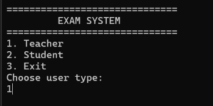
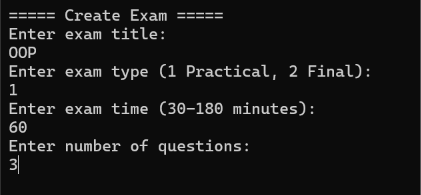
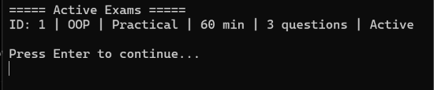
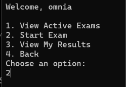
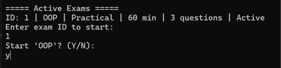
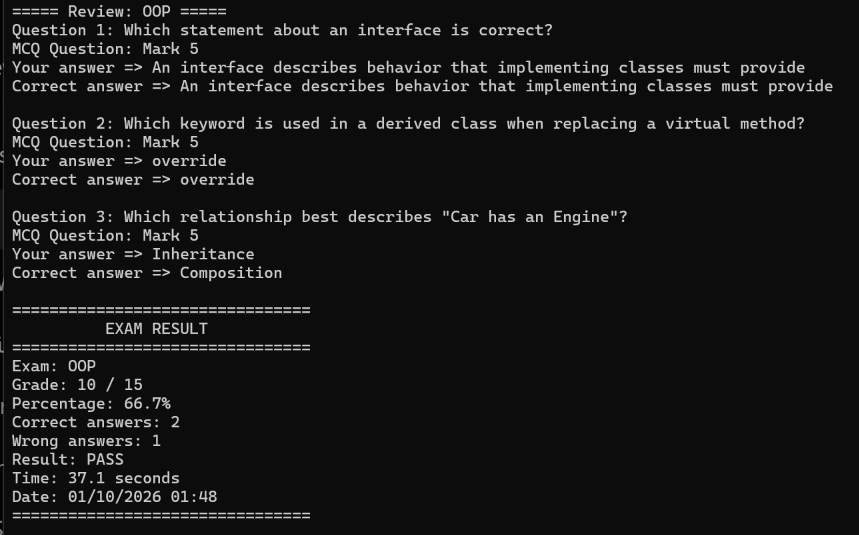

# 🎓 OOP Examination System

A C# console-based examination system built to demonstrate **Object-Oriented Programming (OOP)** concepts through a practical teacher/student exam workflow.

The project supports **Final Exams**, **Practical Exams**, **MCQ questions**, **True/False questions**, exam status management, grading, student results, and result history while the program is running.

---

## 🎥 Console App Demo

<video controls>
  <source src="assets/OOP_Exam_Demo.mp4" type="video/mp4">
</video>

> The animation above shows the expected console flow of the current project.

---

## 📸 Screenshots

### Main Menu

The application starts by asking whether the user is a **Teacher** or **Student**.



### Teacher — Create Exam

The teacher can create an exam, choose its type, duration, and number of questions.




### Student — Start Exam

Students can view active exams and choose one to start.



<br><br>



<br><br>




### Exam Result

After finishing, the student sees the grade, percentage, correct/wrong answers, pass/fail status, and elapsed time.



---

## ✨ Features

### 👩‍🏫 Teacher

- Create **Practical** or **Final** exams
- Add questions during exam creation
- View all created exams
- Change exam status:
  - `Draft`
  - `Active`
  - `Closed`
- Only `Active` exams are available to students

### 👨‍🎓 Student

- Enter student ID and name
- View active exams
- Start an exam by ID
- Answer MCQ and True/False questions
- View the final result
- View previous results while the application is still running

### 📊 Result Details

Each result stores:

- Exam ID
- Exam title
- Grade
- Total grade
- Percentage
- Pass / Fail
- Correct answers
- Wrong answers
- Time taken
- Date taken

---

## 🧠 OOP Concepts Used

### Inheritance

```text
Question
├── MCQQuestion
└── TrueFalseQuestion

Exam
├── FinalExam
└── PracticalExam
```

### Abstraction

`Question` and `Exam` are abstract base classes.

```csharp
public abstract class Question
```

```csharp
public abstract class Exam
```

### Polymorphism

The project can use the base type:

```csharp
Exam exam;
```

and assign either:

```csharp
new PracticalExam(...)
```

or:

```csharp
new FinalExam(...)
```

The overridden implementation runs depending on the actual exam object.

### Encapsulation

Important values such as question body, mark, answer list, right answer, and exam time are controlled through properties and validation.

### Interfaces

`Question` implements:

```csharp
ICloneable
IComparable
```

to support cloning and comparison.

---

## 🏗️ Project Structure

```text
C45-G83-EXAM02
│
├── Answers.cs
├── Check.cs
├── Creation.cs
├── Exam.cs
├── ExamResult.cs
├── FinalExam.cs
├── HandleExceptions.cs
├── MCQQuestion.cs
├── PracticalExam.cs
├── Program.cs
├── Question.cs
├── Student.cs
├── Subject.cs
├── TrueFalseQuestion.cs
└── C45-G83-EXAM02.csproj
```

---

## 📁 File Responsibilities

| File | Responsibility |
|---|---|
| `Program.cs` | Main flow and Teacher/Student menus |
| `Subject.cs` | Stores subject information and multiple exams |
| `Exam.cs` | Base class for exam types |
| `FinalExam.cs` | Final exam creation, execution, review, and result |
| `PracticalExam.cs` | Practical exam creation, execution, review, and result |
| `Question.cs` | Base class for question types |
| `MCQQuestion.cs` | MCQ display behavior |
| `TrueFalseQuestion.cs` | True/False display behavior |
| `Answers.cs` | Represents an answer choice |
| `Creation.cs` | Creates MCQ and True/False question objects |
| `Check.cs` | Validates console input |
| `HandleExceptions.cs` | Repeats input until it is valid |
| `Student.cs` | Stores student information and results |
| `ExamResult.cs` | Stores and displays result details |

---

## 🔄 Application Flow

```text
                     EXAM SYSTEM
                          │
                ┌─────────┴─────────┐
                │                   │
             Teacher             Student
                │                   │
         Create / View Exam     View Active Exams
                │                   │
         Change Exam Status      Start Exam
                │                   │
          Draft / Active        Answer Questions
             / Closed               │
                                    │
                                Submit Exam
                                    │
                                ExamResult
                                    │
                         Grade / % / Pass-Fail
```

---

## 📝 Exam Rules

### Final Exam

Can contain:

- MCQ
- True / False

### Practical Exam

Can contain:

- MCQ only

---

## ▶️ How to Run

### Visual Studio

1. Open `C45-G83-EXAM02.csproj`.
2. Build the project.
3. Press **Ctrl + F5** or click **Start**.
4. Choose Teacher or Student.

### .NET CLI

```bash
dotnet run
```

---

## 🧪 Example OOP Questions

### MCQ

```text
Which OOP principle hides the internal implementation of an object?

1. Inheritance
2. Encapsulation
3. Polymorphism
4. Abstraction

Correct Answer: 2
```

### True / False

```text
C# supports multiple inheritance between classes.

1. True
2. False

Correct Answer: 2
```

---

## ⚠️ Current Limitation

The current version stores exams, students, and results **in memory only**.

When the application closes, that data is lost.

A future version can connect the project to **SQL Server** using ADO.NET or EF Core for permanent storage.

---

## 🚀 Possible Future Improvements

- SQL Server database
- Login system
- ASP.NET Core Web API
- HTML/CSS/JavaScript frontend
- Question bank
- Randomized questions
- Exam deadlines
- Teacher statistics and reports

---

## 🛠️ Technologies

- C#
- .NET
- OOP
- LINQ
- Collections
- Exception Handling
- Console Application

---

## 👤 Author

**Omnia Nabil**  

